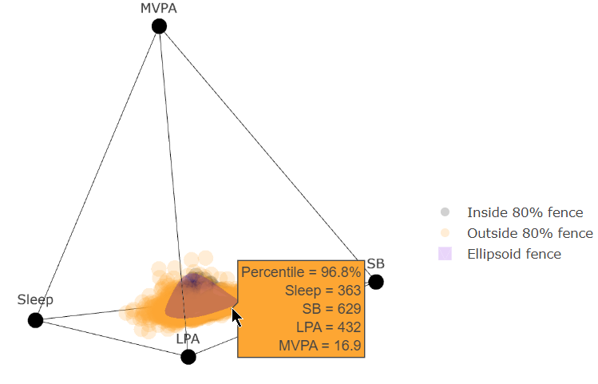
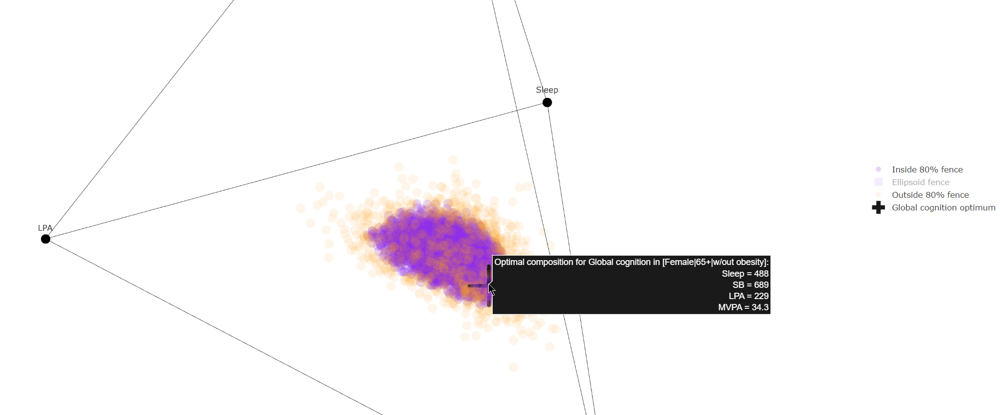

# ukbb-cog-lasso

An analysis pipeline to provide personalised time-use suggestions, via *group LASSO* regression on the UK Biobank data, for optimising various cognitive outcomes.

## Background

Please see the below papers for more details and context:

* "['Small Steps' towards improving 24-hour time-use behaviours to decrease the risk of
dementia: protocol for a personalised, web-based randomised controlled trial in community-
dwelling older adults](https://doi.org/10.1101/2025.05.26.25328336)". Mellow et al. (2025). *Submitted/under review (link to pre-print).*
* "[An interactive tool to personalise 24-hour activity, sitting and sleep prescription for optimal health outcomes](https://doi.to.follow/)". Mellow et al. (2025). *Submitted/under review (updated link to following publication).*

## Workflow

This repository provides the analysis code for

* preparing, cleaning anbd processing the raw UK Biobank data
* fitting *group LASSO* models for each cognitive outcome with optimisation of the regularisation (lambda) parameter via 10-fold cross-validation (mean square prediction error)
* *group LASSO* diagnostics
* 4-simplex grid creation and ellipsoid fence constraint calculations (with interactive plots of 4-simplex time-use compositional data [see below])
* machinery to create predictions from new data inputs (time-use and covariates/other person specific predictors)
* optimisation calculations of LASSO model cognitive outcome predictions over ellipsoid fence constrained time-use grids and personal predictors

The process is summarised in the below flowchart:

**Please note the `user input` elements in the above flowchart are facilitated via a Shiny app available as another repository: [`tystan/ideal-day`](https://github.com/tystan/ideal-day).**

## Fun plots of the 4-simplex because we can

(Screenshots of the `plotly`/html interactive figures)

